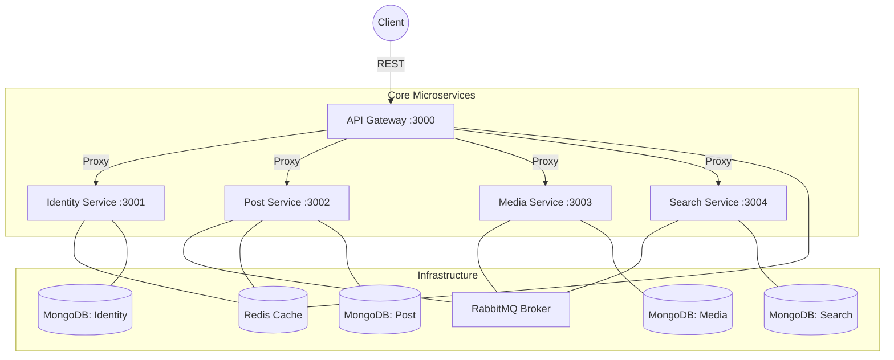

# 🚀 Node.js Social Media Microservices Architecture

A robust, enterprise-grade social media backend built using a **Microservices Architecture**. This project demonstrates scalable service design, event-driven communication, and a professional CI/CD deployment pipeline.

---

## 🏗️ Architecture Overview

The system is composed of five independent microservices communicating via **REST APIs** for synchronous requests and **RabbitMQ** for asynchronous event-driven tasks.



---

## 🛠️ Tech Stack

- **Runtime:** Node.js (ES Modules)
- **Framework:** Express.js
- **Databases:** MongoDB (Mongoose ODM)
- **Messaging:** RabbitMQ (Asynchronous events)
- **Caching/Storage:** Redis (Session management & Rate limiting)
- **Security:** JWT Authentication, Argon2 Hashing, Helmet.js
- **Containerization:** Docker & Docker Compose
- **CI/CD:** GitHub Actions, Docker Hub
- **Cloud/External:** Cloudinary (Media management)

---

## 📦 Microservices Breakdown

### 1. 🛡️ Identity Service
Handles user authentication and authorization.
- JWT-based authentication (Access & Refresh tokens).
- Argon2 password hashing.
- Redis-backed session management.

### 2. 📝 Post Service
Manages user posts and social interactions.
- CRUD operations for social posts.
- Emits events to RabbitMQ when posts are created/deleted.
- Integrated Redis for high-speed retrieval.

### 3. 📸 Media Service
Handles image and video uploads.
- Integrated with **Cloudinary** for cloud storage.
- Listens for media-related events via RabbitMQ.
- Efficient stream-based processing.

### 4. 🔍 Search Service
High-performance search engine.
- Updates search indexes in real-time by consuming RabbitMQ events.
- Provides optimized query endpoints for finding posts and users.

### 5. 🚪 API Gateway
The unified entry point for the frontend.
- **Dynamic Proxying:** Routes requests to appropriate services.
- **Global Rate Limiting:** Redis-based request throttling.
- **Auth Aggregation:** Validates tokens before forwarding requests.

---

## 🚀 Getting Started

### Prerequisites
- Node.js (v18+)
- Docker & Docker Compose
- MongoDB, Redis, and RabbitMQ (if running locally)

### Local Development (via Docker)
The easiest way to spin up the entire ecosystem:

1. **Clone the repository:**
   ```bash
   git clone https://github.com/Richwell111/Microservices-Nodejs-Social-Media.git
   cd Microservices-Nodejs-Social-Media
   ```

2. **Configure Environment:**
   Run the setup script or manually copy `.env.example` files:
   ```bash
   cp api-gateway/.env.example api-gateway/.env
   # Repeat for all services...
   ```

3. **Spin up the stack:**
   ```bash
   docker compose up --build
   ```
   *Your API will now be available at `http://localhost:3000`.*

---

## 🔄 CI/CD & Deployment

This project uses a production-grade deployment pipeline:

1. **Build & Push:** On every push to `main`, GitHub Actions builds Docker images for all 5 services.
2. **Registry:** Images are pushed to **Docker Hub** (`richwell111/<service-name>`).
3. **Automated Deploy:** The pipeline SSHs into a **Linux VPS**, creates the necessary directory structure and `.env` files, pulls the latest images, and restarts the containers using `docker compose up -d`.

---

## 🔐 Environment Variables

Each service contains its own `.env.example`. Key variables include:
- `MONGODB_URI`: Connection string for individual service databases.
- `RABBITMQ_URL`: URL for the message broker.
- `REDIS_URL`: Connection string for the cache.
- `JWT_SECRET`: Secret key for signing tokens.
- `cloud_name`, `api_key`, `api_secret`: Cloudinary credentials for the Media Service.

---

## 📜 License
Integrated under the **ISC License**. Created with ❤️ by [Richwell](https://github.com/Richwell111).
